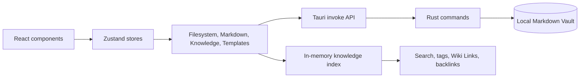

# Personal Knowledge Base

English | [简体中文](./README.zh-CN.md)

> A local-first desktop knowledge base for organizing, editing, and connecting portable Markdown notes.

## Overview

Personal Knowledge Base is a Windows-oriented desktop application for people who want a structured knowledge workspace without giving up ownership of their files. A Vault is an ordinary folder on the local disk; notes remain Markdown files with YAML frontmatter and can be opened with other tools.

The application combines a three-column workspace with a Tauri filesystem boundary: a file tree on the left, a Markdown source editor in the center, and note properties and knowledge links on the right. The project is currently an **early MVP / prototype**. The main local Vault workflow works, while release hardening, broader automated coverage, and several advanced knowledge features are still planned.

## Features

The following features are implemented in the current source tree:

- Create a new Vault or open an existing local Vault.
- Recursively scan a Vault and display folders, Markdown notes, and assets in a file tree.
- Read and write Markdown files with YAML frontmatter.
- Preserve a stable note ID for future references and indexing.
- Edit Markdown in a lightweight source-mode editor.
- Edit common note properties such as title, category, topic, type, status, tags, and source.
- Save notes through an atomic write path in the Rust/Tauri layer.
- Protect filesystem operations with Vault-relative path validation and symlink skipping.
- Rename and move files or folders, or move them to the Vault trash, through an in-app context menu.
- Search indexed notes by title, path, content, metadata, and tags.
- Extract tags, resolve Wiki Links, report unresolved or ambiguous links, and show backlinks.
- Create notes from blank pages or Markdown templates found under `90-Templates`.
- Capture short ideas into the `00-Inbox` folder.
- Browse Inbox notes and navigate between related notes.
- Switch between light, dark, and system themes.
- Use keyboard shortcuts for search, new note, quick capture, and save.

## Screenshots

The repository does not currently include committed screenshots. The application can be previewed locally with the Tauri development command described below.

## Tech Stack

| Area | Technology |
| --- | --- |
| Desktop shell | Tauri 2 |
| Frontend | React 19, TypeScript |
| Build tool | Vite 6 |
| State management | Zustand 5 |
| Markdown metadata | `yaml` |
| UI icons | `lucide-react` |
| Native layer | Rust 2021, Tauri commands |
| Testing | Vitest |
| Package manager | npm |
| Storage | Local Markdown files; no database is used |

## Architecture

The UI does not access the local filesystem directly. React components read UI state and dispatch actions through Zustand. Filesystem, Markdown, knowledge-index, and template concerns live in service modules; the filesystem client invokes explicit Tauri commands implemented in Rust.



Core boundaries:

- `src/components` renders the workspace and user interactions.
- `src/stores` keeps transient UI and Vault session state; it does not own the file system.
- `src/lib/markdown.ts` parses and serializes Markdown plus frontmatter.
- `src/services/filesystem` is the TypeScript boundary for Tauri filesystem commands.
- `src/services/knowledge` builds the in-memory index, search results, tags, Wiki Links, backlinks, and note-creation requests.
- `src/services/templates` discovers and renders Markdown templates.
- `src-tauri/src/lib.rs` validates Vault-relative paths and performs scanning, reading, atomic writes, renames, moves, and trash operations.

## Project Structure

```text
personal-knowledge-base/
├── src/
│   ├── app/              # App shell and global keyboard shortcuts
│   ├── components/       # Workspace, dialogs, editor, sidebar, and panels
│   ├── lib/              # Markdown and metadata helpers
│   ├── services/         # Filesystem, knowledge-index, and template services
│   ├── stores/           # Zustand UI and Vault session state
│   └── types/            # Domain, UI, and note-creation types
├── src-tauri/
│   ├── src/              # Rust commands and native application entrypoint
│   ├── icons/            # Tauri bundle icons
│   └── tauri.conf.json   # Desktop build and window configuration
├── docs/                 # Architecture, data model, roadmap, and project state
├── package.json
├── package-lock.json
└── vite.config.ts
```

## Getting Started

### Prerequisites

- Node.js with npm
- A Rust toolchain supported by Tauri 2
- On Windows, a working WebView2 runtime and the native build prerequisites required by Tauri

The repository does not pin exact Node.js or Rust versions. Use versions supported by the installed Tauri 2 toolchain.

### Installation

```bash
git clone https://github.com/MountCoder-merry/personal-knowledge-base.git
cd personal-knowledge-base
npm install
```

### Development

Run the browser development server:

```bash
npm run dev
```

Run the actual desktop application:

```bash
npm run tauri dev
```

Use the Tauri desktop window for Vault creation, folder selection, and local-file operations. The browser Vite page is useful for frontend development, but it cannot provide the native Tauri `invoke` and folder-picker behavior.

### Testing

```bash
npm run typecheck
npm run test
```

### Build

Build the frontend:

```bash
npm run build
```

Check the Rust/Tauri layer:

```bash
cargo check --manifest-path src-tauri/Cargo.toml
```

The generic Tauri script also exposes the CLI, including the bundle command:

```bash
npm run tauri build
```

## Available Scripts

| Command | Purpose |
| --- | --- |
| `npm run dev` | Start the Vite development server at the configured local dev URL. |
| `npm run tauri dev` | Start Vite and the native Tauri desktop shell. |
| `npm run typecheck` | Run TypeScript project checks without emitting application code. |
| `npm run test` | Run the Vitest test suite once. |
| `npm run build` | Type-check and create a production Vite build in `dist/`. |
| `npm run preview` | Serve the generated Vite build for local preview. |
| `npm run tauri build` | Invoke the Tauri CLI to build desktop bundles. |

There is currently no dedicated `lint` script.

## Usage

1. Start the desktop app with `npm run tauri dev`.
2. Create a Vault by choosing a parent folder and a Vault name, or open an existing Vault directory.
3. Select a Markdown file from the Explorer to load it into the source editor.
4. Edit Markdown or properties in the right panel, then press **Save** or `Ctrl/Cmd+S`.
5. Use **New Note** to create a note, optionally selecting a template discovered under `90-Templates`.
6. Use **Capture** to save a short idea to `00-Inbox`.
7. Use the search field (`Ctrl/Cmd+K`) to find indexed notes.
8. Use `[[Note Title]]` syntax in Markdown to create Wiki Link references. Resolved links and backlinks appear in the properties panel.
9. Right-click a file or folder in the Explorer to rename it, move it, or move it to the Vault trash.

Notes are ordinary files on disk. The current editor is Markdown source mode; it does not provide a rich-text editor or database-backed document format.

## Design Decisions

### Markdown remains the source of truth

Vault content is stored as Markdown files with frontmatter rather than in an application database. This keeps notes portable, inspectable, and recoverable outside the application.

### Domain state is separate from UI state

`KnowledgeNote`, `Vault`, `NoteMetadata`, and `FileTreeNode` describe the domain. Zustand stores keep selections, panels, drafts, theme preference, and the current Vault session separate from those domain objects.

### Native file access has an explicit boundary

React code calls the TypeScript filesystem client, which invokes named Tauri commands. Rust performs path containment checks, skips symlinks while scanning, and writes notes through a temporary file plus replacement flow on Windows.

### Indexing is currently in memory

Opening a Vault builds an in-memory index from Markdown notes. Search, tags, Wiki Links, and backlinks operate on that index; no external search engine or vector database is involved.

## Current Status

The project is an **early MVP / prototype**.

Stable enough to exercise locally:

- Vault creation and opening
- Real local Markdown file tree
- Markdown source editing and atomic saving
- Basic note metadata editing
- Local search, tags, Wiki Links, backlinks, templates, capture, and Inbox
- Light/dark/system themes and desktop UI shell

Known limitations:

- There is no cloud sync, account system, database, or remote backend.
- There is no rich-text editor, file watcher, incremental index, or conflict-resolution UI.
- Metadata parsing intentionally supports a constrained primitive model; complex nested frontmatter is not fully preserved.
- Some error states, loading feedback, accessibility details, and desktop end-to-end coverage still need work.
- The project has no CI workflow, release automation, or lint script yet.
- Tauri development currently reports minor npm/Rust package-version mismatch warnings. `npm run tauri dev` has been verified, but `npm run tauri build` is currently blocked by that mismatch and needs dependency alignment before release packaging.

## Roadmap

### Completed

- Foundation: Tauri 2, React, TypeScript, Vite, npm, domain types, stores, and three-column shell.
- Local Vault and filesystem-backed Markdown editor.
- Atomic writes, path validation, symlink skipping, and trash moves.
- In-memory note indexing with search, tags, Wiki Links, and backlinks.
- Template-based note creation, Quick Capture, and Inbox.
- In-app file action menu and modal flows for rename, move, and trash operations.

### In Progress

- More consistent error codes, loading states, operation feedback, and recovery paths.
- Broader tests for Rust filesystem commands and critical desktop workflows.
- Stronger conflict handling for create, rename, and move operations.
- Documentation, CI, and release-readiness improvements.

### Planned

- Rich Markdown editing experience.
- File watching and incremental indexing for larger Vaults.
- More compatible frontmatter preservation and validation.
- Advanced navigation such as command palette, richer tag management, and graph views.
- PDF and other document ingestion.
- Embeddings, vector retrieval, RAG, AI assistance, cloud sync, and accounts.

Planned items are not part of the current implementation.

## Testing

The project uses Vitest. The current tests cover:

- Markdown frontmatter parsing and serialization
- Metadata normalization used by the properties panel
- Knowledge indexing, tags, search, Wiki Link resolution, and backlinks
- Template rendering and note-creation behavior

Run the suite with:

```bash
npm run test
```

The latest verified local run contains **4 test files and 13 tests**. Rust unit coverage exists for selected path-validation behavior, while full filesystem integration and desktop UI end-to-end coverage are still planned.

## Contributing

1. Fork the repository and create a focused branch.
2. Install dependencies with `npm install`.
3. Keep changes scoped to one problem or feature.
4. Run `npm run typecheck`, `npm run test`, and `npm run build` before opening a pull request.
5. If the change touches the native layer, also run `cargo check --manifest-path src-tauri/Cargo.toml`.
6. Describe user-visible behavior, test results, and known limitations in the pull request.

Please avoid adding database, cloud, or AI dependencies without first discussing the data model and privacy implications.

## License

License has not been specified yet.
