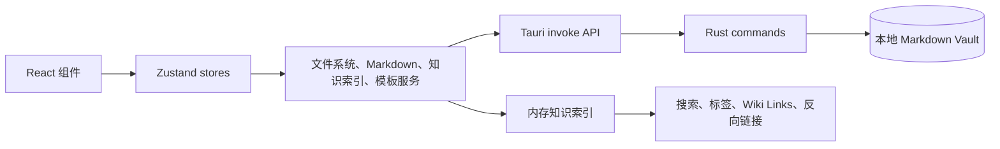

# Personal Knowledge Base

[English](./README.md) | 简体中文

> 一个以本地 Markdown 文件为核心的桌面知识库，用于整理、编辑和连接个人笔记。

## 项目简介

Personal Knowledge Base 是一个面向 Windows 桌面环境的个人知识库应用，适合希望保留本地文件控制权、同时获得结构化知识管理体验的用户。Vault 本质上是本地磁盘上的普通文件夹，笔记以带 YAML frontmatter 的 Markdown 文件保存，可以继续使用其他工具打开。

应用提供三栏工作区：左侧是文件树，中间是 Markdown 源码编辑器，右侧是笔记属性和知识链接面板。项目当前处于 **早期 MVP / Prototype** 阶段：本地 Vault 的主要流程已经可用，但发布完善、更完整的自动化测试和高级知识功能仍在后续规划中。

## 功能特性

以下功能均已在当前源代码中实现：

- 创建新的 Vault，或打开已有的本地 Vault。
- 递归扫描 Vault，展示文件夹、Markdown 笔记和资源文件。
- 读取和写入带 YAML frontmatter 的 Markdown 文件。
- 为笔记保留稳定唯一 ID，为未来引用和索引提供基础。
- 使用轻量 Markdown 源码编辑器编辑笔记。
- 编辑标题、分类、主题、类型、状态、标签和来源等常用属性。
- 通过 Rust/Tauri 层执行原子写入。
- 对 Vault 内相对路径进行校验，并在扫描时跳过符号链接。
- 通过应用内上下文菜单重命名、移动文件或文件夹，或将其移动到 Vault 回收目录。
- 按标题、路径、正文、元数据和标签搜索已建立索引的笔记。
- 提取标签、解析 Wiki Link，识别未解析或有歧义的链接，并展示反向链接。
- 从空白页面或 `90-Templates` 下的 Markdown 模板创建笔记。
- 将临时想法快速保存到 `00-Inbox`。
- 浏览 Inbox 笔记，并在相关笔记之间跳转。
- 支持浅色、深色和跟随系统主题。
- 支持搜索、新建笔记、快速捕获和保存等键盘快捷键。

## 截图

当前仓库没有提交截图文件。可以按照下面的 Tauri 开发命令在本地预览应用。

## 技术栈

| 领域 | 技术 |
| --- | --- |
| 桌面容器 | Tauri 2 |
| 前端 | React 19、TypeScript |
| 构建工具 | Vite 6 |
| 状态管理 | Zustand 5 |
| Markdown 元数据 | `yaml` |
| UI 图标 | `lucide-react` |
| 原生层 | Rust 2021、Tauri commands |
| 测试 | Vitest |
| 包管理 | npm |
| 存储 | 本地 Markdown 文件，不使用数据库 |

## 架构

React 组件不直接访问本地文件系统。组件通过 Zustand 读取界面状态并派发操作；文件系统、Markdown、知识索引和模板逻辑位于独立 service 模块中，文件系统 client 再调用 Rust/Tauri commands。



主要边界如下：

- `src/components`：工作区和用户交互组件。
- `src/stores`：临时 UI 状态和 Vault 会话状态，不直接拥有文件系统。
- `src/lib/markdown.ts`：Markdown 与 frontmatter 的解析和序列化。
- `src/services/filesystem`：Tauri 文件系统命令的 TypeScript 边界。
- `src/services/knowledge`：内存索引、搜索、标签、Wiki Links、反向链接和笔记创建请求。
- `src/services/templates`：Markdown 模板的发现和渲染。
- `src-tauri/src/lib.rs`：路径校验、扫描、读取、原子写入、重命名、移动和回收操作。

## 项目结构

```text
personal-knowledge-base/
├── src/
│   ├── app/              # 应用壳和全局快捷键
│   ├── components/       # 工作区、对话框、编辑器、侧边栏和面板
│   ├── lib/              # Markdown 和 metadata 工具
│   ├── services/         # 文件系统、知识索引和模板服务
│   ├── stores/           # Zustand UI 与 Vault 会话状态
│   └── types/            # Domain、UI 和创建笔记类型
├── src-tauri/
│   ├── src/              # Rust commands 和原生入口
│   ├── icons/            # Tauri 打包图标
│   └── tauri.conf.json   # 桌面构建和窗口配置
├── docs/                 # 架构、数据模型、路线图和项目状态
├── package.json
├── package-lock.json
└── vite.config.ts
```

## 快速开始

### 环境要求

- 安装 Node.js 和 npm
- 安装 Tauri 2 支持的 Rust toolchain
- Windows 下需要可用的 WebView2 runtime，以及 Tauri 所需的原生构建环境

仓库没有锁定精确的 Node.js 或 Rust 版本，请使用当前 Tauri 2 工具链支持的版本。

### 安装

```bash
git clone https://github.com/MountCoder-merry/personal-knowledge-base.git
cd personal-knowledge-base
npm install
```

### 开发运行

启动浏览器开发服务器：

```bash
npm run dev
```

启动真正的桌面应用：

```bash
npm run tauri dev
```

Vault 创建、文件夹选择和本地文件操作请使用 Tauri 桌面窗口测试。浏览器中的 Vite 页面适合前端开发，但不能提供原生 Tauri `invoke` 和文件夹选择器能力。

### 测试

```bash
npm run typecheck
npm run test
```

### 构建

构建前端：

```bash
npm run build
```

检查 Rust/Tauri 层：

```bash
cargo check --manifest-path src-tauri/Cargo.toml
```

通用 Tauri script 也暴露了 CLI，包括桌面 bundle 构建：

```bash
npm run tauri build
```

## 可用脚本

| 命令 | 用途 |
| --- | --- |
| `npm run dev` | 在配置的本地地址启动 Vite 开发服务器。 |
| `npm run tauri dev` | 同时启动 Vite 和 Tauri 桌面应用。 |
| `npm run typecheck` | 执行 TypeScript 项目检查。 |
| `npm run test` | 执行一次 Vitest 测试套件。 |
| `npm run build` | 先检查 TypeScript，再生成 `dist/` 前端构建产物。 |
| `npm run preview` | 本地预览已生成的 Vite 构建。 |
| `npm run tauri build` | 调用 Tauri CLI 构建桌面 bundle。 |

当前项目没有独立的 `lint` script。

## 使用方式

1. 执行 `npm run tauri dev` 启动桌面应用。
2. 选择父目录和 Vault 名称创建 Vault，或打开已有 Vault 文件夹。
3. 在 Explorer 中选择 Markdown 文件，加载到源码编辑器。
4. 编辑 Markdown 或右侧属性面板，点击 **Save** 或按 `Ctrl/Cmd+S` 保存。
5. 点击 **New Note** 创建笔记，可选择 `90-Templates` 下发现的模板。
6. 点击 **Capture** 将临时想法保存到 `00-Inbox`。
7. 使用搜索框（`Ctrl/Cmd+K`）查找已建立索引的笔记。
8. 在 Markdown 中使用 `[[Note Title]]` 语法创建 Wiki Link；已解析链接和反向链接会显示在属性面板。
9. 在 Explorer 中右键文件或文件夹，可以重命名、移动，或移动到 Vault 回收目录。

笔记始终是本地磁盘上的普通文件。当前编辑器是 Markdown 源码模式，不提供富文本编辑器，也不使用数据库格式保存文档。

## 设计说明

### Markdown 是数据源

Vault 内容使用 Markdown 和 frontmatter 保存，而不是应用数据库。这样可以保持笔记可移植、可检查，也能在应用之外恢复和编辑。

### Domain 状态与 UI 状态分离

`KnowledgeNote`、`Vault`、`NoteMetadata` 和 `FileTreeNode` 表达领域模型；Zustand 只管理选中项、面板、草稿、主题和当前 Vault 会话，避免把 React 状态写入领域对象。

### 原生文件访问有明确边界

React 代码调用 TypeScript filesystem client，再由它调用明确的 Tauri commands。Rust 层负责路径包含校验、扫描时跳过符号链接，并在 Windows 上通过临时文件和替换流程执行写入。

### 索引目前驻留内存

打开 Vault 时，应用从 Markdown 笔记构建内存索引。搜索、标签、Wiki Links 和反向链接都基于该索引，不依赖外部搜索引擎或向量数据库。

## 当前状态

项目当前处于 **早期 MVP / Prototype** 阶段。

当前可以稳定进行本地试用的功能：

- Vault 创建和打开
- 真实本地 Markdown 文件树
- Markdown 源码编辑和原子保存
- 基础笔记属性编辑
- 本地搜索、标签、Wiki Links、反向链接、模板、快速捕获和 Inbox
- 浅色/深色/系统主题和桌面 UI

已知限制：

- 没有云同步、账号系统、数据库或远程后端。
- 没有富文本编辑器、文件监听、增量索引或完整冲突解决界面。
- Metadata 解析目前支持受限的基础值模型，复杂嵌套 frontmatter 尚未完整保留。
- 错误状态、加载反馈、可访问性和桌面端到端测试仍需加强。
- 当前没有 CI workflow、发布自动化或 lint script。
- Tauri 开发启动目前会提示 npm/Rust 包 minor 版本不一致。`npm run tauri dev` 已验证可以启动，但 `npm run tauri build` 目前会因版本不一致阻塞，需要先统一依赖版本才能进行发布打包。

## 路线图

### 已完成

- Foundation：Tauri 2、React、TypeScript、Vite、npm、领域类型、stores 和三栏壳。
- 本地 Vault 和基于文件系统的 Markdown 编辑器。
- 原子写入、路径校验、符号链接跳过和回收目录。
- 支持搜索、标签、Wiki Links 和反向链接的内存索引。
- 模板创建、Quick Capture 和 Inbox。
- 重命名、移动、回收操作的应用内菜单和对话框流程。

### 进行中

- 更统一的错误码、加载状态、操作反馈和恢复路径。
- Rust 文件系统命令和桌面关键流程的更多测试。
- 更严格的创建、重命名和移动冲突处理。
- 文档、CI 和发布准备工作。

### 计划中

- 更完整的 Markdown 编辑体验。
- 面向大型 Vault 的文件监听和增量索引。
- 更兼容的 frontmatter 保留和校验。
- Command Palette、更完整的标签管理和知识图谱视图。
- PDF 和其他文档导入。
- Embedding、向量检索、RAG、AI 辅助、云同步和账号系统。

计划中的功能尚未包含在当前实现中。

## 测试

项目使用 Vitest，当前测试覆盖：

- Markdown frontmatter 解析和序列化
- Properties 面板使用的 metadata 归一化
- 知识索引、标签、搜索、Wiki Link 解析和反向链接
- 模板渲染和笔记创建行为

运行测试：

```bash
npm run test
```

最近一次本地验证包含 **4 个测试文件、13 个测试**。Rust 已对部分路径校验逻辑提供单元测试，但完整文件系统集成测试和桌面 UI 端到端测试仍在计划中。

## 贡献

1. Fork 仓库并创建聚焦单一问题的分支。
2. 执行 `npm install` 安装依赖。
3. 每次修改尽量只解决一个明确的问题或功能。
4. 创建 Pull Request 前运行 `npm run typecheck`、`npm run test` 和 `npm run build`。
5. 如果修改了原生层，再运行 `cargo check --manifest-path src-tauri/Cargo.toml`。
6. 在 Pull Request 中说明用户可见行为、验证结果和已知限制。

在没有讨论数据模型和隐私影响之前，请不要直接引入数据库、云端或 AI 依赖。

## License

项目目前尚未指定许可证。
